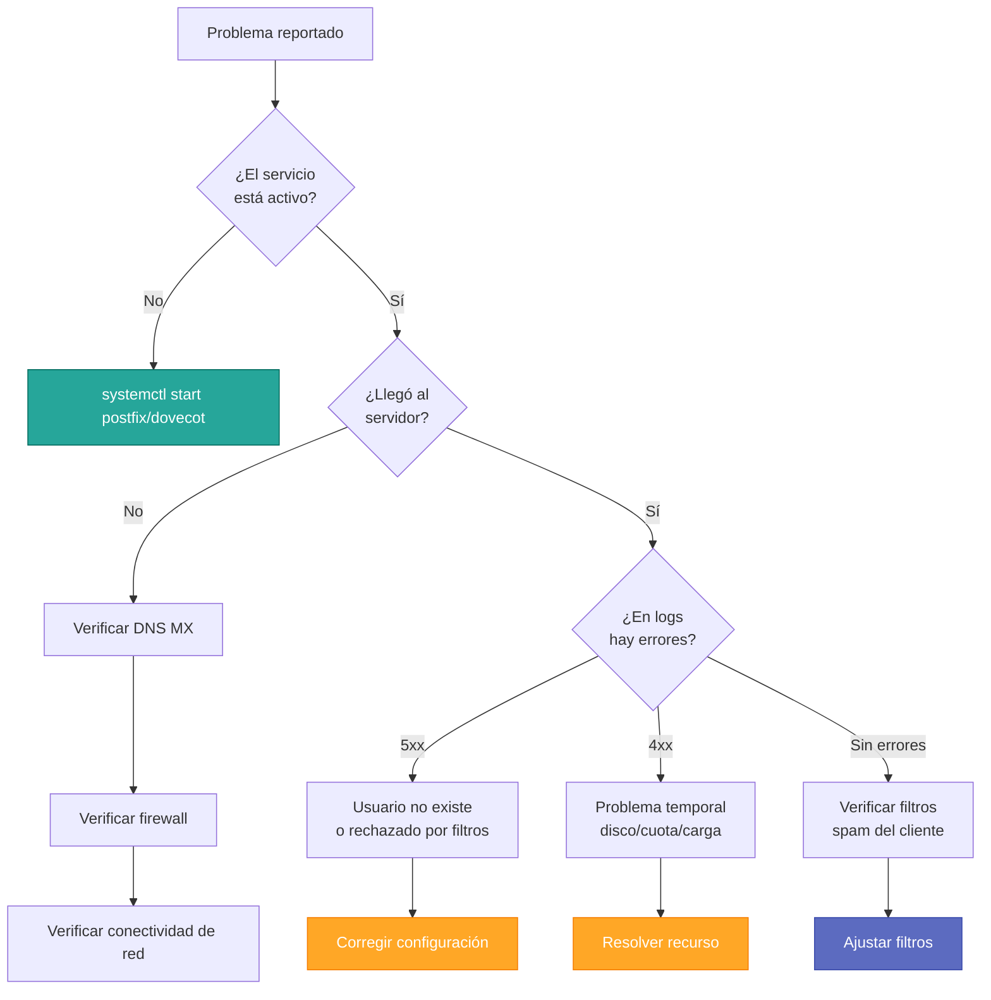

# Administración y Diagnóstico de Servidores de Correo

## Introducción

La administración profesional de un servidor de correo Linux requiere conocimientos sobre  la **estructura de configuración** del software MTA/MDA y la capacidad de **interpretar registros del sistema** (logs) para diagnosticar y resolver problemas eficientemente.

---

## Estructura de Configuración

### Postfix (MTA)

**Postfix** es el MTA más utilizado en entornos Linux modernos debido a su equilibrio entre seguridad, rendimiento y facilidad de configuración.

#### Archivo Principal: main.cf

Ubicación: `/etc/postfix/main.cf`

**Parámetros críticos**:

```conf
# Identidad del servidor
myhostname = mail.ejemplo.com
mydomain = ejemplo.com
myorigin = $mydomain

# Redes de confianza - CRÍTICO PARA SEGURIDAD
mynetworks = 127.0.0.0/8 [::1]/128 192.168.1.0/24

# Destinos locales
mydestination = $myhostname, localhost.$mydomain, localhost, $mydomain

# Formato de buzón
home_mailbox = Maildir/

# Restricciones de recepción (antispam)
smtpd_recipient_restrictions =
    permit_mynetworks,
    permit_sasl_authenticated,
    reject_unauth_destination,
    reject_invalid_hostname,
    reject_non_fqdn_recipient,
    reject_unknown_recipient_domain

# Tamaño máximo de mensaje (50MB)
message_size_limit = 52428800

# TLS para conexiones entrantes
smtpd_tls_cert_file = /etc/ssl/certs/mail.ejemplo.com.pem
smtpd_tls_key_file = /etc/ssl/private/mail.ejemplo.com.key
smtpd_use_tls = yes
smtpd_tls_security_level = may

# TLS para conexiones salientes
smtp_tls_security_level = may
smtp_tls_loglevel = 1
```

!!! danger "Peligro: Open Relay"
    **NUNCA** configurar `mynetworks` como `0.0.0.0/0`. Esto convierte el servidor en un **Open Relay**, permitiendo a spammers enviar correo masivo a través de su infraestructura.
    
    **Incorrecto**:
    ```conf
    mynetworks = 0.0.0.0/0  # ¡PELIGRO!
    ```
    
    **Correcto**:
    ```conf
    mynetworks = 127.0.0.0/8 [::1]/128 192.168.1.0/24
    ```

#### Comandos de Gestión Postfix

```bash
# Verificar configuración
postconf -n

# Comprobar fichero de configuración
postfix check

# Recargar configuración (sin interrumpir servicio)
postfix reload

# Reiniciar servicio
systemctl restart postfix

# Ver estado del servicio
systemctl status postfix

# Ver cola de correos
postqueue -p

# Forzar procesamiento de cola
postqueue -f

# Eliminar un correo específico de la cola
postsuper -d ID_CORREO

# Vaciar toda la cola
postsuper -d ALL
```

---

### Dovecot (MDA/IMAP)

**Dovecot** es el servidor IMAP/POP3 estándar actual, también funciona como MDA.

#### Estructura de Configuración

Ubicación: `/etc/dovecot/dovecot.conf` (archivo principal)  
Módulos: `/etc/dovecot/conf.d/` (configuración modular)

**Archivos clave**:

10-mail.conf
:   Ubicación y formato de buzones

```conf
mail_location = maildir:~/Maildir
mail_privileged_group = mail
```

10-auth.conf
:   Mecanismos de autenticación

```conf
disable_plaintext_auth = yes
auth_mechanisms = plain login
```

10-ssl.conf
:   Configuración TLS/SSL

```conf
ssl = required
ssl_cert = </etc/ssl/certs/dovecot.pem
ssl_key = </etc/ssl/private/dovecot.key
ssl_min_protocol = TLSv1.2
```

10-master.conf
:   Sockets y servicios

#### Comandos de Gestión Dovecot

```bash
# Verificar configuración
doveconf -n

# Recargar configuración
doveadm reload

# Ver usuarios conectados
doveadm who

# Expurgar mensajes eliminados
doveadm expunge -u usuario@ejemplo.com mailbox INBOX all

# Ver cuota de usuario
doveadm quota get -u usuario@ejemplo.com
```

---

## Diagnóstico y Logs

### Ubicación de Logs

Sistema basado en Debian/Ubuntu
:   `/var/log/mail.log`  
    `/var/log/mail.err`

Sistema basado en RedHat/CentOS
:   `/var/log/maillog`

Systemd journal
:   `journalctl -u postfix -f`  
    `journalctl -u dovecot -f`

### Códigos de Estado SMTP

Al analizar logs, es fundamental interpretar los códigos de respuesta SMTP de tres dígitos:

#### Tabla Completa de Códigos

| Código | Significado | Descripción | Acción del Emisor |
|:------:|:------------|:------------|:------------------|
| **2xx** | **Éxito** | Comando aceptado correctamente | Ninguna |
| 220 | Service ready | Servidor listo para conexión | Continuar |
| 221 | Closing connection | Cierre normal | Terminar |
| 250 | OK | Acción completada | Continuar |
| 251 | User not local | Usuario no local, reenvío | Aceptar |
| **3xx** | **Intermedio** | Comando aceptado, se necesita más información | Enviar datos |
| 354 | Start mail input | Comenzar a enviar datos | Enviar mensaje |
| **4xx** | **Error Temporal** | Fallo transitorio, reintentar más tarde | Encolar y reintentar |
| 421 | Service not available | Servicio temporalmente no disponible | Reintentar después |
| 450 | Mailbox unavailable | Buzón ocupado temporalmente | Reintentar después |
| 451 | Action aborted | Error local en procesamiento | Reintentar después |
| 452 | Insufficient storage | Insuficiente espacio en disco | Reintentar después |
| **5xx** | **Error Permanente** | Fallo fatal, no reintentar | Generar bounce |
| 500 | Syntax error | Comando no reconocido | Reportar error |
| 501 | Syntax error in parameters | Parámetros incorrectos | Reportar error |
| 502 | Command not implemented | Comando no implementado | Reportar error |
| 550 | Mailbox unavailable | Usuario no encontrado | Bounce al remitente |
| 551 | User not local | Usuario no local, sin reenvío | Bounce al remitente |
| 552 | Exceeded storage | Cuota de buzón excedida | Bounce al remitente |
| 553 | Mailbox name invalid | Nombre de buzón inválido | Bounce al remitente |
| 554 | Transaction failed | Transacción fallida | Bounce al remitente |

!!! note "Clasificación de Códigos"
    - **2xx**: Todo OK, continuar
    - **3xx**: Esperando más información
    - **4xx**: Error temporal, **reintentar automáticamente**
    - **5xx**: Error permanente, **NO reintentar**, notificar al remitente

### Ejemplos de Análisis de Logs

#### Ejemplo 1: Entrega Exitosa

```log
Feb 06 11:30:15 mail postfix/smtpd[1234]: connect from cliente.ejemplo.com[192.0.2.50]
Feb 06 11:30:15 mail postfix/smtpd[1234]: 3A4F51234: client=cliente.ejemplo.com[192.0.2.50]
Feb 06 11:30:16 mail postfix/cleanup[1235]: 3A4F51234: message-id=<20260206103015.3A4F51234@mail.ejemplo.com>
Feb 06 11:30:16 mail postfix/qmgr[1020]: 3A4F51234: from=<usuario@origen.com>, size=1234, nrcpt=1
Feb 06 11:30:16 mail postfix/smtp[1236]: 3A4F51234: to=<destino@ejemplo.com>, relay=mail.destino.com[198.51.100.50]:25, status=sent (250 OK)
Feb 06 11:30:16 mail postfix/qmgr[1020]: 3A4F51234: removed
```

**Interpretación**: Correo recibido de `usuario@origen.com`, procesado y entregado exitosamente a `destino@ejemplo.com`. Código 250 indica éxito.

#### Ejemplo 2: Usuario No Encontrado (5xx)

```log
Feb 06 11:35:20 mail postfix/smtp[1240]: 4B5G62345: to=<noexiste@ejemplo.com>, relay=mail.ejemplo.com[192.0.2.10]:25, status=bounced (550 5.1.1 User unknown)
```

**Interpretación**: Error **permanente** 550 - el usuario no existe. El correo será devuelto al remitente (bounce).

#### Ejemplo 3: Disco Lleno (4xx)

```log
Feb 06 12:00:30 mail postfix/smtp[1250]: 5C6H73456: to=<usuario@ejemplo.com>, relay=mail.ejemplo.com[192.0.2.10]:25, status=deferred (452 4.2.2 Mailbox full)
```

**Interpretación**: Error **temporal** 452 - buzón lleno. Postfix reintentará automáticamente (deferred).

---

## Flujo de Troubleshooting



---

## Comandos Esenciales de Diagnóstico

### Verificación de Conectividad

```bash
# Probar conexión SM TP
telnet mail.ejemplo.com 25

# Probar SMTP con STARTTLS
openssl s_client -connect mail.ejemplo.com:587 -starttls smtp

# Probar IMAP
telnet mail.ejemplo.com 143

# Probar IMAPS (TLS)
openssl s_client -connect mail.ejemplo.com:993
```

### Análisis de Logs en Tiempo Real

```bash
# Seguir log de correo
tail -f /var/log/mail.log

# Filtrar solo errores
grep -i error /var/log/mail.log

# Buscar correo específico por ID
grep "3A4F51234" /var/log/mail.log

# Filtrar por remitente
grep "from=<usuario@ejemplo.com>" /var/log/mail.log

# Ver intentos de conexión rechazados
grep "reject" /var/log/mail.log
```

### Verificación de Servicios

```bash
# Ver puertos en escucha
netstat -tulpn | grep -E "25|587|143|993"

# o con ss (más moderno)
ss -tulpn | grep -E "25|587|143|993"

# Verificar procesos
ps aux | grep postfix
ps aux | grep dovecot
```

---

## Mejores Prácticas de Administración

!!! tip "Recomendaciones"
    
    **Monitoreo**:
    
    - Implementar alertas para cola de correo grande (`postqueue -p`)
    - Monitorear espacio en disco (buzones pueden crecer rápidamente)
    - Configurar logrotate para logs de correo
    
    **Seguridad**:
    
    - Revisar periódicamente `mynetworks` en Postfix
    - Mantener actualizado el software (Postfix, Dovecot)
    - Analizar logs en busca de intentos de relay no autorizado
    - Implementar fail2ban para bloquear IPs con intentos de login fallidos
    
    **Mantenimiento**:
    
    - Backup regular de buzones de usuario
    - Limpieza periódica de mensajes en cuarentena
    - Rotación de logs
    - Actualización de certificados TLS antes de expiración

---

## Próximos Pasos

Para completar su conocimiento:

- Revise **[Seguridad](seguridad.md)** para configurar SPF, DKIM y DMARC
- Practique en un entorno de laboratorio antes de aplicar cambios en producción