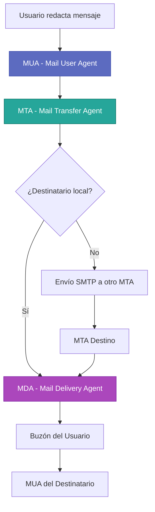

# Conceptos Básicos del Correo Electrónico

## Definición del Servicio

El **correo electrónico** es un servicio de red que permite a los usuarios enviar y recibir mensajes mediante sistemas de comunicación electrónica. A diferencia de la mensajería instantánea, donde ambas partes deben estar conectadas simultáneamente, el correo electrónico es intrínsecamente **asíncrono**.

---

## Características Fundamentales

El diseño del correo electrónico se basa en tres pilares fundamentales que lo diferencian de otros sistemas de comunicación:

Asincronía
:   El emisor y el receptor **no requieren estar conectados simultáneamente**. Los servidores intermedios almacenan el mensaje (técnica conocida como *store-and-forward*) hasta su entrega final. Esto permite enviar correos a cualquier hora, independientemente de si el destinatario está en línea.

Estandarización
:   Su funcionamiento **no depende de un software propietario**, sino de protocolos abiertos y públicos definidos en **RFCs** (Request for Comments). Esto garantiza la interoperabilidad: un usuario de Gmail puede comunicarse sin problemas con uno de Outlook o con un servidor corporativo auto-hospedado.

Identidad Única
:   Los usuarios se identifican mediante una **dirección de correo electrónico única** formada por la estructura canónica: `usuario@dominio`. Esta dirección es globalmenteúnica y permite enrutar el mensaje a través de Internet hacia el servidor correcto.

---

## El Modelo de Red

El servicio de correo electrónico opera bajo el modelo arquitectónico **Cliente-Servidor** sobre la pila de protocolos **TCP/IP**. Este modelo garantiza la fiabilidad en la entrega de datos.

!!! note "Fiabilidad TCP"
    El correo electrónico utiliza **TCP** (Transmission Control Protocol) como protocolo de transporte. TCP establece conexiones fiables antes de transmitir cualquier dato, garantizando:
    
    - **Control de errores**: Detección y retransmisión de paquetes perdidos
    - **Orden de entrega**: Los datos llegan en el mismo orden en que fueron enviados
    - **Control de flujo**: Adaptación a la velocidad del receptor
    
    Esto evita la pérdida de paquetes común en protocolos sin conexión como UDP, asegurando que los mensajes lleguen íntegros o se notifique un error en caso contrario.

---

## Componentes del Sistema

El ecosistema del correo electrónico involucra varios componentes que trabajan coordinadamente:

Estos componentes se analizan en detalle en la sección de [Arquitectura del Sistema](arquitectura.md).

---

## Ventajas del Modelo Asíncrono

!!! tip "Beneficios de la Asincronía"
    
    El modelo asíncrono del correo electrónico ofrece ventajas significativas:
    
    - **Disponibilidad 24/7**: Los mensajes se envían y reciben en cualquier momento
    - **Tolerancia a fallos**: Si el servidor destino no está disponible, el mensaje se encola y se reintenta automáticamente
    - **Independencia geográfica**: Funciona independientemente de la zona horaria
    - **Registro permanente**: Los mensajes quedan almacenados para consulta posterior

---

## Diferencias con Otros Servicios de Mensajería

| Característica | Correo Electrónico | Mensajería Instantánea |
|:---------------|:-------------------|:-----------------------|
| **Sincronía** | Asíncrono | Síncrono (requiere presencia) |
| **Protocolo** | Estándares abiertos (SMTP/IMAP) | Propietarios en su mayoría |
| **Almacenamiento** | Servidor (persistente) | Cliente o servidor (variable) |
| **Fiabilidad** | Alta (TCP + reintentos) | Media (depende del servicio) |
| **Interoperabilidad** | Universal entre dominios | Limitada a mismo servicio |

---

## Próximos Pasos

Una vez comprendidos los conceptos fundamentales, es esencial entender cómo se estructura técnicamente el sistema de correo electrónico:

- Continúa con **[Arquitectura del Sistema](arquitectura.md)** para conocer los agentes involucrados (MUA, MTA, MDA)
- Explora los **[Protocolos de Comunicación](protocolos.md)** para entender SMTP, IMAP y POP3
- Descubre la importancia de **[DNS en la infraestructura de correo](dns_infraestructura.md)**