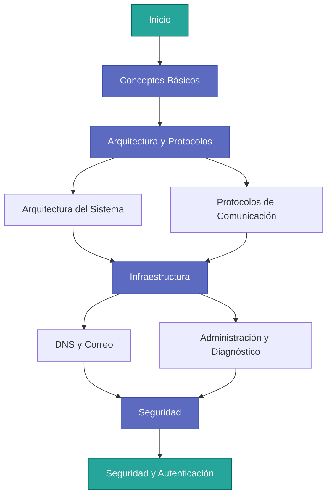

# Bienvenida

## Administración de Servicios de Correo Electrónico

Bienvenido a la documentación técnica profesional sobre **administración de servicios de correo electrónico** en entornos de red empresariales. Este material constituye una guía completa que aborda desde los fundamentos teóricos hasta las técnicas avanzadas de seguridad y diagnóstico necesarias para comprender, desplegar y mantener infraestructuras de mensajería robustas y seguras.

---

## Estructura del Curso

El contenido está organizado en módulos progresivos que cubren todos los aspectos fundamentales de los sistemas de correo electrónico:

---

## Objetivos de Aprendizaje

!!! abstract "Propósito del Material Didáctico"
    
    Este curso tiene como objetivos:
    
    - **Comprender** la arquitectura cliente-servidor aplicada a sistemas de mensajería
    - **Dominar** los protocolos estándar de comunicación (SMTP, IMAP, POP3)
    - **Analizar** las dependencias de infraestructura de red (DNS, registros MX)
    - **Implementar** mecanismos de seguridad y autenticación modernos
    - **Diagnosticar** problemas mediante interpretación de logs y códigos de estado

---

## Navegación Rápida

Accede directamente a las secciones principales del curso:

-   :material-book-open-page-variant:{ .lg .middle } **Conceptos Básicos**

    ---

    Fundamentos del correo electrónico, modelo cliente-servidor y características del servicio
    
    [:octicons-arrow-right-24: Ir a Conceptos Básicos](conceptos_base.md)

-   :material-network:{ .lg .middle } **Arquitectura y Protocolos**

    ---

    Agentes del sistema (MUA, MTA, MDA), protocolos de comunicación y formatos de almacenamiento
    
    [:octicons-arrow-right-24: Ver Arquitectura](arquitectura.md)
    [:octicons-arrow-right-24: Ver Protocolos](protocolos.md)

-   :material-dns:{ .lg .middle } **Infraestructura**

    ---

    Registros DNS, configuración de servidores y herramientas de administración
    
    [:octicons-arrow-right-24: Ver DNS](dns_infraestructura.md)
    [:octicons-arrow-right-24: Ver Administración](administracion.md)

-   :material-shield-lock:{ .lg .middle } **Seguridad**

    ---

    Cifrado TLS, autenticación SPF/DKIM/DMARC y prevención de spam
    
    [:octicons-arrow-right-24: Ir a Seguridad](seguridad.md)

---

## Alcance de los Contenidos

El temario abarca los siguientes aspectos teóricos y prácticos:

Arquitectura Cliente-Servidor
:   Diferenciación clara de roles entre los distintos agentes: MUA (usuario), MTA (transferencia) y MDA (entrega). Comprensión del flujo completo de un correo electrónico desde origen hasta destino.

Estándares RFC
:   Análisis detallado de los protocolos industriales: **SMTP** para envío, **POP3** e **IMAP** para recepción. Comprensión de las diferencias funcionales y casos de uso apropiados.

Infraestructura de Red
:   Dependencias críticas del **Sistema de Nombres de Dominio (DNS)**: registros MX, A/AAAA, PTR. Configuración de zonas DNS para servicios de correo.

Seguridad y Autenticación
:   Mecanismos modernos de protección: cifrado en tránsito (**TLS/SSL**), validación de origen (**SPF**), integridad de mensajes (**DKIM**), y políticas unificadas (**DMARC**).

Gestión y Diagnóstico
:   Interpretación profesional de registros del sistema (logs), análisis de códigos de estado SMTP, detección y resolución de problemas comunes.

---

## Metodología de Estudio

!!! tip "Recomendaciones para el Aprendizaje"
    
    Para aprovechar al máximo este material:
    
    1. **Seguir el orden propuesto**: Los módulos están diseñados para construir conocimiento progresivamente
    2. **Practicar con ejemplos**: Cada sección incluye casos prácticos y configuraciones reales
    3. **Experimentar en entornos de prueba**: Se recomienda configurar laboratorios virtuales para validar los conceptos

---

## Información del Curso

**Autores**: Teodoro Sibón Jiménez y José Luis Cabello Pérez  
**Año**: 2026  
**Nivel**: Técnico Superior  
**Área**: Administración de Sistemas Informáticos en Red

!!! info "Nota sobre el Material"
    Este documento forma parte del material didáctico oficial para la formación en administración de sistemas de red. Todo el contenido se basa en estándares industriales reconocidos y documentación técnica verificada.