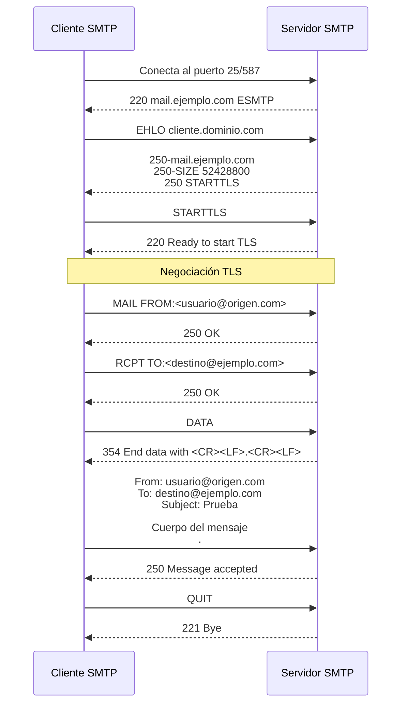
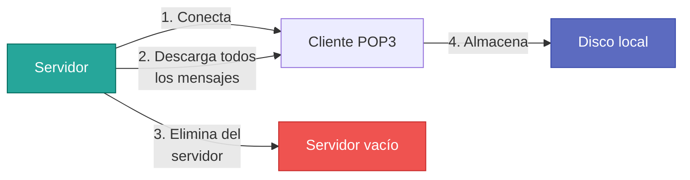
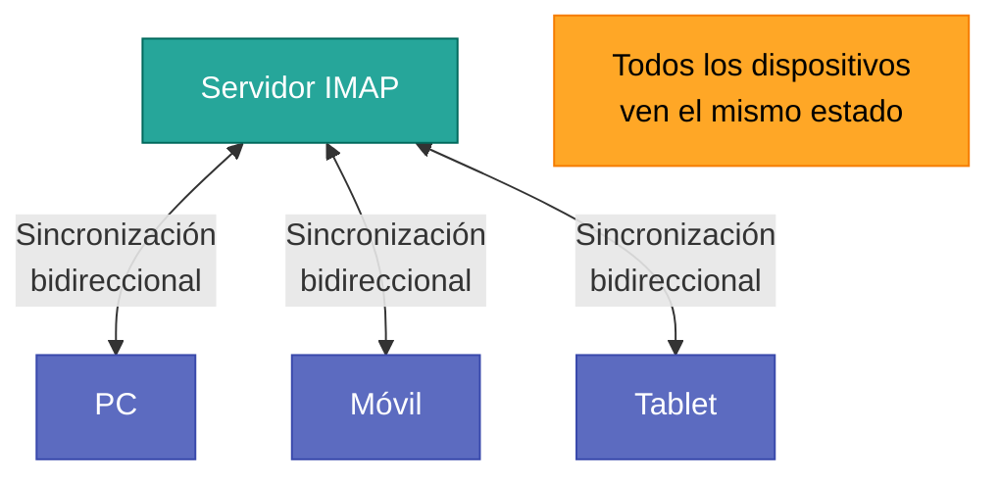

# Protocolos de Comunicación

## Introducción

La comunicación entre los distintos agentes del sistema de correo (MUA, MTA, MDA) se rige por **protocolos específicos** según la dirección del flujo de datos. Es fundamental distinguir entre protocolos de **envío** (push) y de **recepción** (pull).


---

## Protocolos de Envío

### SMTP (Simple Mail Transfer Protocol)

**Definición**: Es el protocolo estándar para el intercambio de correo electrónico entre servidores y para el envío inicial desde el cliente al servidor.

**RFC de referencia**: [RFC 5321](https://www.rfc-editor.org/rfc/rfc5321.html)

#### Características Técnicas

Naturaleza del protocolo
:   Protocolo de **texto plano** basado en comandos ASCII. La comunicación es legible por humanos, lo que facilita el diagnóstico manual.

Modelo de comunicación
:   **Cliente-Servidor** sobre **TCP**. El cliente envía comandos y el servidor responde con códigos numéricos de tres dígitos.

Tipo de operación
:   **Push** (empujar). SMTP solo sirve para **enviar correo**, no para descargarlo. El cliente "empuja" el mensaje hacia el servidor.

#### Flujo de una Sesión SMTP



#### Comandos SMTP Principales

| Comando | Descripción | Ejemplo |
|:--------|:------------|:--------|
| `HELO` / `EHLO` | Identificación del cliente (EHLO para Extended SMTP) | `EHLO cliente.ejemplo.com` |
| `MAIL FROM` | Especifica el remitente del correo | `MAIL FROM:<usuario@origen.com>` |
| `RCPT TO` | Especifica el destinatario | `RCPT TO:<destino@ejemplo.com>` |
| `DATA` | Inicia la transferencia del contenido del mensaje | `DATA` |
| `QUIT` | Cierra la conexión SMTP | `QUIT` |
| `RSET` | Reinicia la transacción actual | `RSET` |
| `VRFY` | Verifica si existe un buzón (usualmente deshabilitado) | `VRFY usuario` |

#### Ejemplo de Sesión SMTP Real

```smtp
220 mail.servidor.com ESMTP Postfix
EHLO cliente.origen.com
250-mail.servidor.com
250-PIPELINING
250-SIZE 10240000
250-VRFY
250-ETRN
250-STARTTLS
250-AUTH PLAIN LOGIN
250-ENHANCEDSTATUSCODES
250-8BITMIME
250 DSN
MAIL FROM:<remitente@origen.com>
250 2.1.0 Ok
RCPT TO:<destinatario@servidor.com>
250 2.1.5 Ok
DATA
354 End data with <CR><LF>.<CR><LF>
From: Remitente <remitente@origen.com>
To: Destinatario <destinatario@servidor.com>
Subject: Mensaje de prueba
Date: Thu, 06 Feb 2026 11:30:00 +0100

Este es el cuerpo del mensaje.
.
250 2.0.0 Ok: queued as 3A2F41234
QUIT
221 2.0.0 Bye
```

!!! warning "Limitación de SMTP"
    SMTP es un protocolo **unidireccional de envío**. No permite consultar ni descargar correos del servidor. Para eso se utilizan IMAP o POP3.

---

## Protocolos de Recepción

Los protocolos de recepción permiten al usuario **consultar y gestionar** su buzón de correo almacenado en el servidor.

### POP3 (Post Office Protocol v3)

**Definición**: Protocolo diseñado para simular un apartado de correos físico tradicional.

**RFC de referencia**: [RFC 1939](https://www.rfc-editor.org/rfc/rfc1939.html)

#### Modelo de Funcionamiento



#### Características

- **Operación**: Se conecta, descarga **todos** los mensajes al dispositivo local y, por defecto, los **elimina del servidor**
- **Filosofía**: "Mover" el correo del servidor al cliente
- **Sincronización**: Inexistente. Los mensajes solo están en un dispositivo
- **Estado**: No mantiene estados (leído/no leído) en el servidor

#### Limitaciones

!!! caution "Uso Obsoleto"
    POP3 es **obsoleto en entornos multidispositivo**:
    
    - No permite ver los correos **enviados** (solo están en el cliente que los envió)
    - No sincroniza estados entre dispositivos (móvil, PC, tablet)
    - Si se pierde el dispositivo, se pierden todos los correos
    - No soporta carpetas del lado del servidor

**Caso de uso válido**: Usuarios con un solo dispositivo y necesidad de acceso offline completo.

---

### IMAP (Internet Message Access Protocol)

**Definición**: Protocolo diseñado para la **gestión remota del buzón** con sincronización completa.

**RFC de referencia**: [RFC 3501](https://www.rfc-editor.org/rfc/rfc3501.html)

#### Modelo de Funcionamiento



#### Características Avanzadas

Almacenamiento en servidor
:   Los correos **permanecen en el servidor**. El cliente solo descarga cabeceras o mensajes completos bajo demanda.

Sincronización bidireccional
:   Los cambios realizados en cualquier dispositivo (leer, marcar, mover, eliminar) se **sincronizan automáticamente** con el servidor y otros clientes.

Gestión de carpetas
:   Soporte completo para **carpetas**, **subcarpetas** y **etiquetas** gestionadas en el servidor.

Búsqueda del lado del servidor
:   Permite realizar búsquedas complejas **en el servidor** sin descargar todos los mensajes.

Modo offline
:   Los clientes modernos pueden cachear mensajes localmente para acceso sin conexión.

#### Ventajas de IMAP

!!! success "Protocolo Recomendado Actual"
    IMAP es el **estándar moderno** para acceso a correo electrónico:
    
    - **Multidispositivo**: Perfecta sincronización entre PC, móvil y tablet
    - **Backup centralizado**: Los correos están seguros en el servidor
    - **Ahorro de ancho de banda**: Solo se descargan los mensajes visualizados
    - **Organización avanzada**: Carpetas, flags, búsquedas complejas
    - **Escalabilidad**: Funciona eficientemente con buzones de miles de mensajes

---

## Comparativa POP3 vs IMAP

| Característica | POP3 | IMAP |
|:---------------|:-----|:-----|
| **Almacenamiento** | Cliente (local) | Servidor (remoto) |
| **Sincronización** | No existe | Completa entre dispositivos |
| **Carpetas del servidor** | No soportadas | Soportadas completamente |
| **Estados (leído/no leído)** | Solo local | Sincronizados |
| **Búsqueda** | Solo en cliente | Servidor y cliente |
| **Acceso multidispositivo** | Problemático | Nativo |
| **Ancho de banda inicial** | Alto (descarga todo) | Bajo (solo cabeceras) |
| **Backup** | Responsabilidad del usuario | Automático en servidor |
| **Uso actual** | Legacy | Estándar moderno |

---

## Tabla de Puertos Estándar

Es **crítico** para la administración de firewalls y configuración de servicios conocer los puertos asignados por la IANA.

| Servicio | Función | Puerto Sin Cifrado | Puerto con TLS/SSL | Protocolo de Transporte |
|:---------|:--------|:------------------:|:------------------:|:-----------------------:|
| **SMTP** | Transferencia entre servidores | 25 | 25 + STARTTLS | TCP |
| **SMTP Submission** | Envío de clientes a servidor | 587 | 465[^1] | TCP |
| **IMAP** | Acceso al buzón | 143 | 993 | TCP |
| **POP3** | Descarga de buzón | 110 | 995 | TCP |

[^1]: Puerto 465 (SMTPS) fue originalmente asignado pero deprecado. Actualmente ha sido rehabilitado para SMTP sobre TLS implícito.

!!! note "Diferencia entre Puertos SMTP"
    
    - **Puerto 25**: Comunicación **servidor a servidor** (MTA ↔ MTA). No requiere autenticación.
    - **Puerto 587** (Submission): Envío de **clientes autenticados** (MUA → MTA). **Requiere autenticación** del usuario.
    - **Puerto 465**: SMTP con TLS implícito (conexión cifrada desde el inicio).

!!! important "Seguridad en Puertos"
    Los puertos **sin cifrado** (25, 143, 110) transmiten credenciales y mensajes en **texto plano**. En entornos de producción modernos se debe:
    
    1. **Forzar TLS** mediante STARTTLS (puertos estándar) o usar puertos TLS implícitos
    2. **Deshabilitar** autenticación en conexiones no cifradas
    3. **Configurar cortafuegos** para permitir solo los puertos necesarios

---

## Próximos Pasos

Ahora que comprendes los protocolos de comunicación, continúa explorando:

- **[Infraestructura DNS](dns_infraestructura.md)**: Cómo los registros MX permiten el enrutamiento de correo
- **[Seguridad](seguridad.md)**: Mecanismos de autenticación y cifrado (SPF, DKIM, DMARC, TLS)
- **[Administración](administracion.md)**: Configuración práctica y análisis de logs