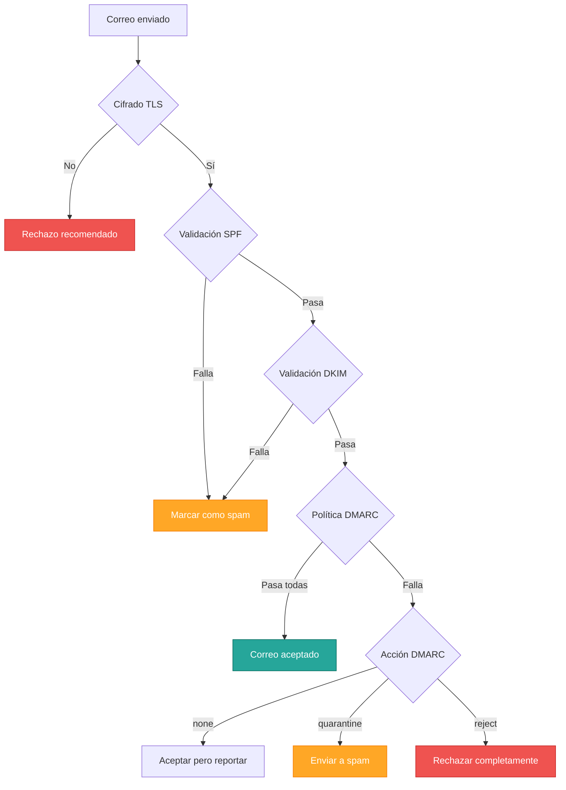
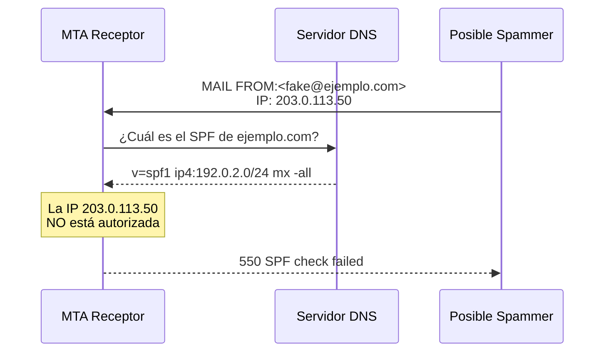
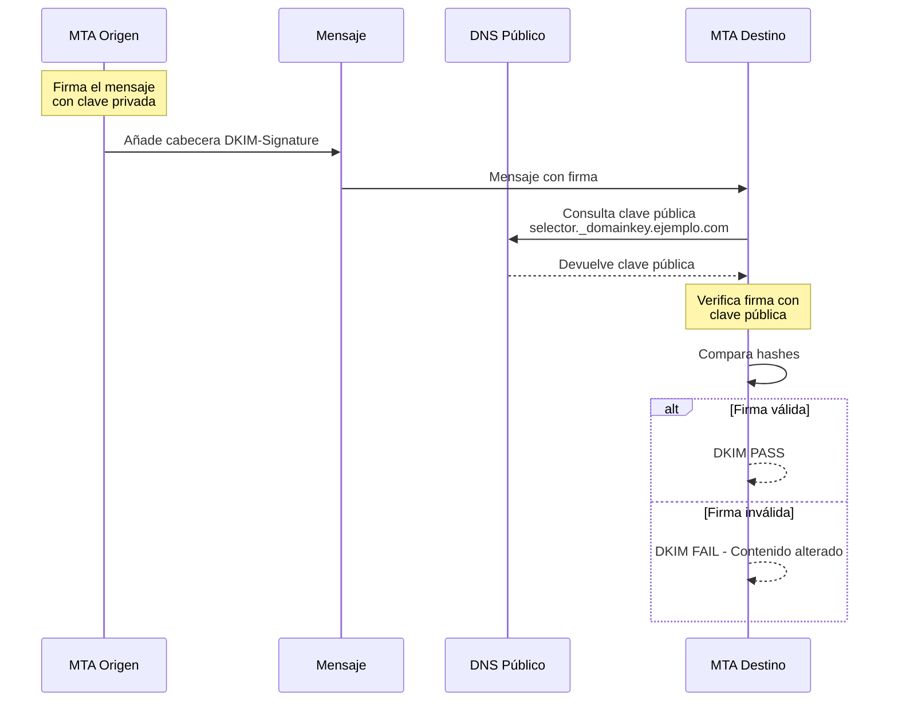

# Seguridad y Autenticación en Correo Electrónico

## Introducción

El protocolo original de correo electrónico (**SMTP**) no fue diseñado con seguridad en mente. En los años 80, Internet era una red académica de  confianza mutua. Para combatir el **spam**, el **phishing** y la **suplantación de identidad (spoofing)**, se han desarrollado múltiples capas adicionales de seguridad que actualmente son imprescindibles en cualquier despliegue profesional.



---

## Cifrado en Tránsito (TLS/SSL)

### Problema: Interceptación de Mensajes

Por defecto, SMTP transmite **todo en texto plano**: credenciales de autenticación, contenido de mensajes, direcciones. Esto lo hace vulnerable a **ataques Man-in-the-Middle (MITM)** donde un atacante intercepta y lee la comunicación.

### Solución: Transport Layer Security (TLS)

**TLS** (Transport Layer Security) cifra la conexión entre cliente y servidor, protegiendo contra la interceptación.

#### Modos de Implementación TLS

===  "STARTTLS (Oportunista)"

    **Descripción**: Permite **elevar** una conexión inicialmente insegura a una cifrada mediante el comando `STARTTLS`.
    
    **Funcionamiento**:
    
    1. Cliente conecta al puerto estándar (25, 587, 143)
    2. Servidor anuncia capacidad STARTTLS
    3. Cliente solicita `STARTTLS`
    4. Se realiza negociación TLS
    5. La conexión continúa ahora cifrada
    
    **Ventajas**:
    
    - Compatibilidad con clientes antiguos que no soportan TLS
    - Usa los puertos estándar
    
    **Desventajas**:
    
    - Vulnerable a ataques de degradación (strip STARTTLS)
    - Requiere configuración explícita para **forzar** TLS

=== "TLS Implícito (Wrapper)"

    **Descripción**: La conexión nace **cifrada desde el primer byte**. No hay fase de texto plano.
    
    **Puertos dedicados**:
    
    - **465**: SMTP sobre TLS (SMTPS)
    - **993**: IMAP sobre TLS (IMAPS)
    - **995**: POP3 sobre TLS (POP3S)
    
    **Ventajas**:
    
    - Protección completa desde el inicio
    - No vulnerable a ataques de degradación
    - Más simple de configurar en cliente
    
    **Desventajas**:
    
    - Requiere puerto dedicado
    - Menor compatibilidad con sistemas legacy

!!! important "Recomendación de Seguridad"
    En entornos de producción modernos:
    
    1. **Deshabilitar completamente** la autenticación sin TLS
    2. Usar puertos con **TLS implícito** (465, 993, 995) cuando sea posible
    3. Si se usa STARTTLS, **forzar** su uso mediante restricciones en el servidor
    4. Configurar certificados SSL/TLS válidos (Let's Encrypt, DigiCert, etc.)

---

## Mecanismos de Autenticación de Dominio

Los tres mecanismos siguientes trabajan juntos para validar que un correo proviene realmente del dominio que afirma ser.

### SPF (Sender Policy Framework)

**Definición**: Mecanismo basado en **DNS** que certifica qué servidores están **autorizados** a enviar correo en nombre de un dominio.

**RFC de referencia**: [RFC 7208](https://www.rfc-editor.org/rfc/rfc7208.html)

#### Funcionamiento



#### Formato del Registro SPF

El registro SPF se publica como registro **TXT** en DNS:

```dns
ejemplo.com.  IN  TXT  "v=spf1 ip4:192.0.2.10 include:_spf.google.com mx -all"
```

**Componentes**:

v=spf1
:   Versión del protocolo SPF

ip4:192.0.2.10
:   Autoriza una IP específica (también puede ser `ip6:` para IPv6)

include:_spf.google.com
:   Incluye las IPs autorizadas de otro dominio (útil para proveedores externos como Google Workspace)

mx
:   Autoriza las IPs de los servidores listados en registros MX

-all
:   Política estricta: **rechazar** cualquier IP no listada

**Calificadores**:

| Calificador | Significado | Acción recomendada |
|:------------|:------------|:-------------------|
| `+` (pass) | Autorizado explícitamente | Aceptar |
| `-` (fail) | NO autorizado - política dura | Rechazar |
| `~` (softfail) | NO autorizado - política suave | Marcar como spam |
| `?` (neutral) | Sin política definida | Ninguna acción |

#### Ejemplo de Validación SPF

```dns
# Empresa con servidor propio y uso de Google Workspace
ejemplo.com. IN TXT "v=spf1 mx ip4:192.0.2.10 include:_spf.google.com -all"
```

**Interpretación**: Están autorizados a enviar correo como `@ejemplo.com`:
- Los servidores listados en los registros MX
- La IP `192.0.2.10`
- Los servidores autorizados por Google (para cuentas Google Workspace)
- Cualquier otra IP será **rechazada** (-all)

---

### DKIM (DomainKeys Identified Mail)

**Definición**: Sistema de **firma digital** que garantiza la **integridad** del mensaje y la autenticidad del dominio emisor.

**RFC de referencia**: [RFC 6376](https://www.rfc-editor.org/rfc/rfc6376.html)

#### Funcionamiento



#### Componentes DKIM

**Clave privada** (en el servidor de origen)
:   Se almacena de forma segura en el servidor MTA. Se usa para firmar los mensajes salientes.

**Clave pública** (en DNS)
:   Se publica como registro TXT con formato especial: `selector._domainkey.dominio.com`

**Cabecera DKIM-Signature**
:   Añadida automáticamente al mensaje. Contiene la firma criptográfica.

#### Ejemplo de Registro DKIM en DNS

```dns
selector1._domainkey.ejemplo.com. IN TXT (
    "v=DKIM1; k=rsa; "
    "p=MIGfMA0GCSqGSIb3DQEBAQUAA4GNADCBiQKBgQDwIRP/UC3SBsEmGqZ9ZJW3/DkMoGeLnQg1fWn7/zYtIxN2SnFCjxOCKG9v3b4jYfcTNh5ijSsq631uBItLa7od+v/RtdC2UzJ1lWT947qR+Rce9VCOlr9lDBTNDLYE3IAVBdYwHTsqLz8KqtD8iAZH7sY2OiO7Mm0XHW3z9CkzxQIDAQAB"
)
```

**Campos**:
- `v=DKIM1`: Versión de DKIM
- `k=rsa`: Tipo de clave (RSA)
- `p=...`: Clave pública en formato Base64

!!! tip "Generación de Claves DKIM"
    La mayoría de MTA modernos (Postfix + OpenDKIM, etc.) incluyen herramiento para generar pares de claves:
    
    ```bash
    opendkim-genkey -s selector1 -d ejemplo.com
    ```

---

### DMARC (Domain-based Message Authentication)

**Definición**: Política que **unifica SPF y DKIM** y especifica qué debe hacer el receptor si fallan las validaciones.

**RFC de referencia**: [RFC 7489](https://www.rfc-editor.org/rfc/rfc7489.html)

#### Propósito de DMARC

DMARC responde a las preguntas:

1. ¿Qué hacer si un correo falla SPF o DKIM?
2. ¿Cómo informar al propietario del dominio sobre intentos de suplantación?

#### Registro DMARC en DNS

```dns
_dmarc.ejemplo.com. IN TXT "v=DMARC1; p=reject; rua=mailto:dmarc@ejemplo.com; ruf=mailto:forensic@ejemplo.com; pct=100"
```

**Parámetros principales**:

| Parámetro | Valores posibles | Descripción |
|:----------|:-----------------|:------------|
| `v` | DMARC1 | Versión del protocolo |
| `p` | none, quarantine, reject | Política para correos que fallan |
| `sp` | none, quarantine, reject | Política para subdominios |
| `rua` | dirección email | Dirección para reportes agregados |
| `ruf` | dirección email | Dirección para reportes forenses (detallados) |
| `pct` | 0-100 | Porcentaje de mensajes a los que aplicar la política |
| `adkim` | r (relaxed), s (strict) | Alineación DKIM |
| `aspf` | r (relaxed), s (strict) | Alineación SPF |

#### Políticas DMARC

none
:   **Modo de monitoreo**. No aplicar ninguna acción, solo enviar reportes. Útil para fase de prueba.

quarantine
:   **Cuarentena**. Enviar a carpeta de spam/cuarentena.

reject
:   **Rechazo total**. El servidor debe rechazar el mensaje directamente.

#### Ejemplo de Implementación Progresiva

```dns
# Fase 1: Monitoreo (2-4 semanas)
_dmarc.ejemplo.com. IN TXT "v=DMARC1; p=none; rua=mailto:dmarc@ejemplo.com"

# Fase 2: Cuarentena parcial
_dmarc.ejemplo.com. IN TXT "v=DMARC1; p=quarantine; pct=25; rua=mailto:dmarc@ejemplo.com"

# Fase 3: Política estricta
_dmarc.ejemplo.com. IN TXT "v=DMARC1; p=reject; rua=mailto:dmarc@ejemplo.com; ruf=mailto:forensic@ejemplo.com"
```

!!! warning "Cuidado con Políticas Estrictas"
    Antes de configurar `p=reject`, asegurarse de que:
    
    - SPF está configurado correctamente
    - DKIM funciona para todos los flujos de correo
    - Se han analizado los reportes DMARC durante al menos 2 semanas
    - Se han identificado y autorizado todos los servidores legítimos

---

## Tabla Comparativa de Mecanismos

| Mecanismo | Valida | Basado en | Previene | Reportes |
|:----------|:-------|:----------|:---------|:---------|
| **SPF** | IP de origen | DNS (TXT) | Suplantación de dominio | No nativamente |
| **DKIM** | Integridad del mensaje | Criptografía + DNS | Alteración de contenido | No nativamente |
| **DMARC** | SPF + DKIM | DNS (TXT) | Uso no autorizado del dominio | Sí (rua/ruf) |
| **TLS** | Cifrado de tránsito | Certificados SSL | Interceptación MITM | No |

---

## Recomendaciones de Implementación

!!! success "Lista de Verificación de Seguridad"
    
    **Nivel Básico** (mínimo recomendado):
    
    - [x] Configurar certificado SSL/TLS válido
    - [x] Habilitar STARTTLS en todos los puertos
    - [x] Deshabilitar autenticación sin cifrado
    - [x] Configurar registro SPF básico
    
    **Nivel Intermedio**:
    
    - [x] Implementar DKIM con claves de 2048 bits
    - [x] Configurar DMARC en modo `p=none`
    - [x] Analizar reportes DMARC durante 2-4 semanas
    - [x] Configurar PTR (reverse DNS)
    
    **Nivel Avanzado**:
    
    - [x] DMARC en modo `p=reject`
    - [x] TLS implícito en puertos dedicados
    - [x] Rotación periódica de claves DKIM
    - [x] Monitoreo automatizado de reportes DMARC
    - [x] MTA-STS (SMTP MTA Strict Transport Security)

---

## Herramientas de Verificación

**Validación de configuración**:

- [MXToolbox](https://mxtoolbox.com/) - Suite completa de herramientas DNS y correo
- [DMARC Analyzer](https://www.dmarcanalyzer.com/) - Análisis de reportes DMARC
- [Mail-Tester](https://www.mail-tester.com/) - Prueba integral de correo saliente

**Comandos de diagnóstico**:

```bash
# Verificar registro SPF
dig ejemplo.com TXT | grep spf

# Verificar DKIM
dig selector._domainkey.ejemplo.com TXT

# Verificar DMARC
dig _dmarc.ejemplo.com TXT

# Probar conexión TLS
openssl s_client -connect mail.ejemplo.com:587 -starttls smtp
```

---

## Próximos Pasos

Con los mecanismos de seguridad comprendidos:

- Revise **[Administración](administracion.md)** para configurar estos mecanismos en Postfix y Dovecot
- Vuelva a **[DNS](dns_infraestructura.md)** para entender cómo publicar registros SPF/DKIM/DMARC