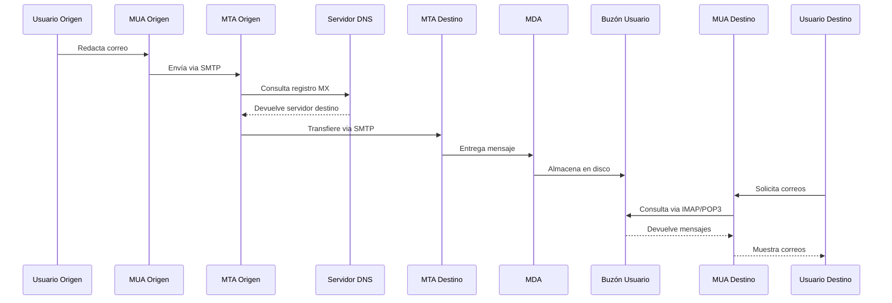
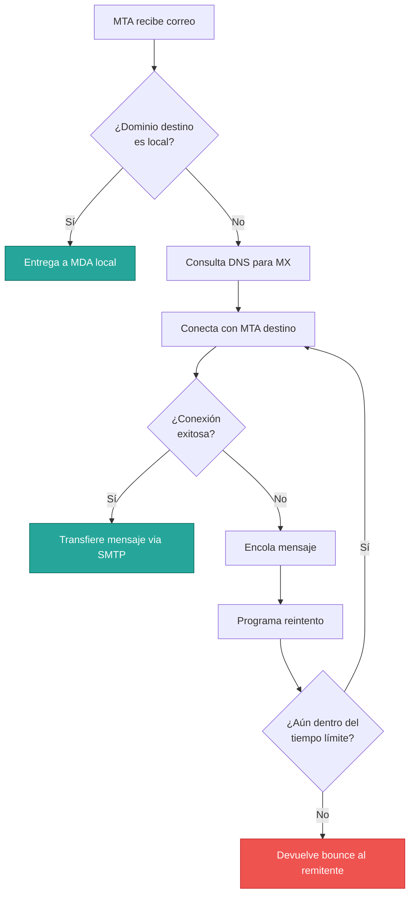
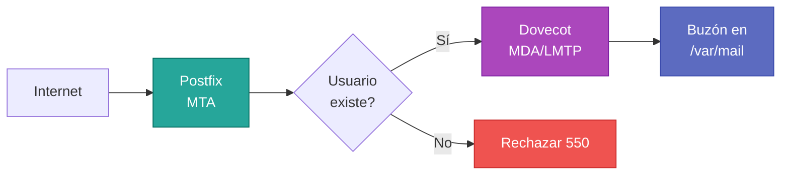
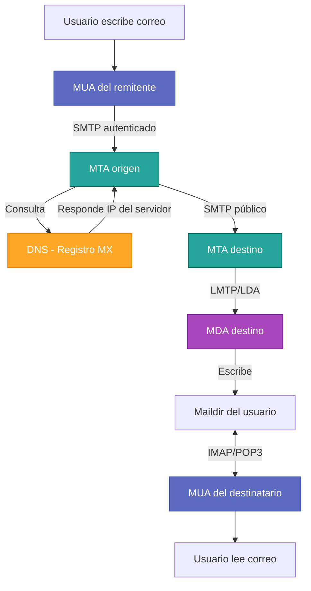

# Arquitectura del Sistema de Correo Electrónico

## Introducción

El flujo de un correo electrónico no es una conexión punto a punto directa entre dos personas, sino una **cadena de relevos** procesada por distintos tipos de software especializado. Comprender la arquitectura del sistema es fundamental para administrar, diagnosticar y optimizar servicios de correo.



---

## Agentes del Sistema

El ecosistema del correo electrónico se compone de tres tipos principales de agentes software, cada uno con responsabilidades específicas:

### MUA (Mail User Agent)

**Definición**: Es el agente de usuario, la aplicación cliente que interactúa directamente con el usuario final.

**Funcionalidades**:

- Permite redactar, enviar y visualizar correos electrónicos
- Proporciona interfaz gráfica o web para gestión de mensajes
- **No almacena** ni gestiona el tránsito del correo por Internet
- Solo interactúa con los servidores inicial (envío) o final (recepción)

**Ejemplos de implementación**:

- **Clientes de escritorio**: Mozilla Thunderbird, Microsoft Outlook, Apple Mail
- **Clientes web (Webmail)**: Roundcube, SquirrelMail, Zimbra
- **Clientes móviles**: K-9 Mail (Android), Mail nativa (iOS)

!!! info "MUA y Protocolos"
    Los MUA utilizan **SMTP** para enviar correos al servidor y **IMAP** o **POP3** para recuperarlos. El usuario final nunca interactúa directamente con estos protocolos; el MUA los gestiona de forma transparente.

---

### MTA (Mail Transfer Agent)

**Definición**: Es el servidor de transferencia, el componente central que actúa como "enrutador" del correo electrónico.

**Funciones principales**:

1. **Recepción**: Acepta mensajes de MUA o de otros MTA
2. **Enrutamiento**: Decide el siguiente salto basándose en el dominio de destino
3. **Transferencia**: Transmite el correo al MTA destino o lo entrega localmente
4. **Encolado**: Almacena temporalmente mensajes que no pueden entregarse inmediatamente
5. **Reintentos**: Programación automática de reenvíos en caso de fallos temporales

**Proceso de decisión del MTA**:



**Software MTA más utilizado**:

| Software | Características | Uso típico |
|:---------|:----------------|:-----------|
| **Postfix** | Modular, seguro, alto rendimiento | Servidores empresariales y proveedores |
| **Exim** | Flexible, altamente configurable | Hosting compartido, sistemas Debian |
| **Sendmail** | Histórico, muy complejo | Sistemas legacy |
| **Microsoft Exchange** | Integrado con Active Directory | Entornos corporativos Windows |

!!! tip "Recomendación para Nuevas Instalaciones"
    **Postfix** es actualmente el MTA más recomendado por su equilibrio entre seguridad, rendimiento y facilidad de configuración. Es el MTA por defecto en la mayoría de distribuciones Linux modernas.

---

### MDA (Mail Delivery Agent)

**Definición**: Es el agente de entrega local. Una vez el correo ha llegado al servidor de destino final, el MTA transfiere el mensaje al MDA para su almacenamiento.

**Responsabilidades**:

- **Escritura en disco**: Almacena el mensaje en el buzón del usuario
- **Filtrado local**: Aplica reglas del usuario (filtros Sieve, carpetas automáticas)
- **Gestión de cuotas**: Controla el espacio en disco asignado por usuario
- **Indexación**: Facilita búsquedas rápidas en buzones grandes

**Software MDA representativo**:

- **Dovecot**: MDA/IMAP moderno, estándar de facto actual
- **Courier**: Suite completa MDA/IMAP/POP3
- **Cyrus IMAP**: Orientado a grandes instalaciones

**Integración MTA/MDA**:



---

## Formatos de Almacenamiento (Buzones)

Existen dos estándares principales para almacenar los correos en el disco duro del servidor Linux. La elección del formato impacta directamente en el rendimiento, fiabilidad y capacidad de recuperación ante fallos.

=== "mbox (Clásico)"

    **Estructura**: Todos los correos de un usuario se concatenan en **un único archivo de texto** plano.
    
    **Ubicación típica**: `/var/mail/usuario` o `/var/spool/mail/usuario`
    
    **Formato interno**:
    ```
    From usuario@ejemplo.com Mon Jan 01 12:00:00 2026
    From: usuario@ejemplo.com
    To: destino@ejemplo.com
    Subject: Primer mensaje
    
    Cuerpo del mensaje 1
    
    From usuario@ejemplo.com Mon Jan 02 13:00:00 2026
    From: usuario@ejemplo.com
    To: otro@ejemplo.com
    Subject: Segundo mensaje
    
    Cuerpo del mensaje 2
    ```
    
    **Ventajas**:
    
    - Sencillez extrema en su implementación
    - Compatible con utilidades UNIX tradicionales (grep, less, cat)
    - Consume menos inodos del sistema de archivos
    
    **Desventajas**:
    
    - **Bloqueo de archivos**: Múltiples procesos no pueden escribir simultáneamente de forma segura
    - **Corrupción total**: Si el archivo se corrompe, se pierden **todos** los correos
    - **Bajo rendimiento**: Con buzones grandes (miles de mensajes), las operaciones son lentas
    - **Sin soporte para flags**: Difícil marcar mensajes individuales como leídos/no leídos

=== "Maildir (Moderno)"

    **Estructura**: Utiliza una **estructura de directorios**. Cada correo es un **archivo individual** con nombre único.
    
    **Organización de carpetas**:
    ```
    ~/Maildir/
    ├── cur/          # Mensajes ya visualizados
    ├── new/          # Mensajes no leídos
    └── tmp/          # Área temporal durante la escritura
    ```
    
    **Nomenclatura de archivos**:
    ```
    1609459200.Vfd01I4000dM123456.servidor.ejemplo.com:2,S
    └─────┬─────┘ └────────┬────────┘ └──────┬──────┘ └┬┘
          │               │                    │         │
      timestamp      identificador         hostname   flags
    ```
    
    **Ventajas**:
    
    - **Alta fiabilidad**: Si un archivo falla, solo se pierde **un correo**
    - **Sin bloqueos**: No requiere bloqueos de archivo, ideal para servidores con alta concurrencia
    - **Rendimiento escalable**: Operaciones rápidas incluso con decenas de miles de mensajes
    - **Soporte de flags**: Estados (leído, respondido, eliminado) mediante sufijos en nombres de archivo
    - **Backup incremental eficiente**: Cada correo es un fichero separado
    
    **Desventajas**:
    
    - Mayor consumo de inodos (limitación en algunos sistemas de archivos)
    - Estructura de directorios más compleja
    
    !!! success "Recomendación Actual"
        **Maildir** es el estándar recomendado para todas las instalaciones modernas. Es utilizado por defecto en Dovecot y soportado por todos los MTA actuales.

---

## Comparativa de Formatos

| Criterio | mbox | Maildir |
|:---------|:-----|:--------|
| **Estructura** | Un archivo único | Un directorio por buzón |
| **Granularidad** | Todos los correos concatenados | Un archivo por correo |
| **Concurrencia** | Requiere locks, bajo rendimiento | Sin locks, alta concurrencia |
| **Fiabilidad** | Corrupción afecta todo el buzón | Corrupción afecta un solo mensaje |
| **Rendimiento con buzones grandes** | Muy bajo | Excelente |
| **Soporte de flags IMAP** | Limitado | Completo |
| **Uso actual** | Legacy, sistemas antiguos | Estándar moderno |

---

## Flujo Completo de un Correo

Integrando todos los componentes, el flujo completo es:



---

## Próximos Pasos

Ahora que comprendes la arquitectura, es momento de profundizar en los protocolos de comunicación:

- Explora **[Protocolos de Comunicación](protocolos.md)** para entender SMTP, IMAP y POP3 en detalle
- Descubre cómo **[DNS gestiona el correo](dns_infraestructura.md)** mediante registros MX
- Aprende sobre **[Seguridad](seguridad.md)** con SPF, DKIM y DMARC