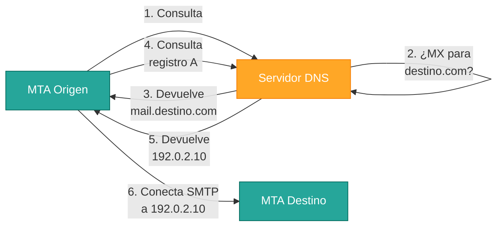
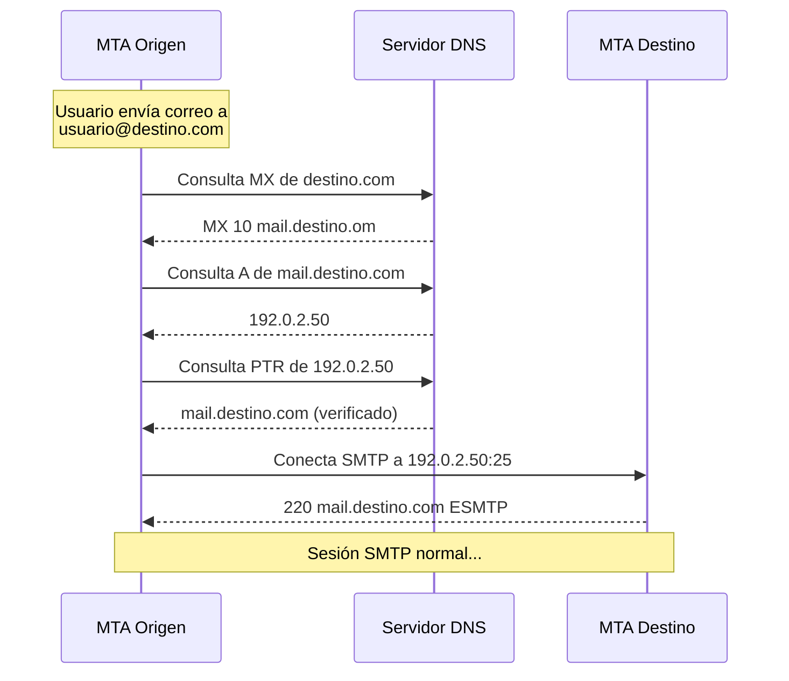

# Infraestructura DNS y Correo Electrónico

## Introducción

El sistema de correo electrónico **no puede funcionar sin DNS** (Domain Name System). Antes de enviar un solo byte de mensaje, los servidores MTA deben **resolver direcciones IP** mediante consultas DNS. La infraestructura DNS es el "directorio telefónico" de Internet para el correo electrónico.



---

## Registros DNS Críticos para Correo

### Registro MX (Mail Exchanger)

**Función**: Indica qué servidor o servidores son los responsables de **recibir** el correo electrónico para un dominio específico.

**Sintaxis básica**:
```
dominio.    TTL    IN    MX    prioridad    servidor-correo.
```

**Características**:

Prioridad
:   Se pueden definir **múltiples registros MX** con diferentes valores de prioridad. El servidor emisor intentará conectar primero con el de número **más bajo** (mayor prioridad). Si falla, probará con el siguiente.

Fallback y redundancia
:   Los registros MX múltiples proporcionan **alta disponibilidad**. Si el servidor principal está caído, el correo se entrega al secundario.

Valor del registro
:   Apunta a un **nombre de dominio completo (FQDN)**, **nunca a una dirección IP directamente**.

#### Ejemplo de Configuración MX

```dns
; Zona DNS para ejemplo.com
ejemplo.com.        IN  MX  10  mail.ejemplo.com.
ejemplo.com.        IN  MX  20  mail2.ejemplo.com.
ejemplo.com.        IN  MX  30  backup.proveedor.com.

; Registros A correspondientes
mail.ejemplo.com.   IN  A   192.0.2.10
mail2.ejemplo.com.  IN  A   192.0.2.11
backup.proveedor.com. IN A 198.51.100.50
```

**Interpretación**:

1. El MTA emisor consulta los registros MX de `ejemplo.com`
2. Intenta entregar al servidor con prioridad 10: `mail.ejemplo.com`
3. Si falla, intenta con prioridad 20: `mail2.ejemplo.com`
4. Como último recurso, usa prioridad 30: `backup.proveedor.com`

!!! tip "Buenas Prácticas MX"
    
    - Configurar **al menos dos registros MX** (principal y fallback) para garantizar la disponibilidad
    - Usar **diferentes redes o proveedores** para los servidores MX secundarios
    - Valores de prioridad típicos: 10, 20, 30 (incrementos de 10 facilitan insertar futuros registros intermedios)

---

### Registro A / AAAA

**Función**: Traduce un **nombre de dominio** a su **dirección IP**.

A (Address)
:   Devuelve una dirección **IPv4** (32 bits). Ejemplo: `192.0.2.10`

AAAA (Quad-A)
:   Devuelve una dirección **IPv6** (128 bits). Ejemplo: `2001:db8::1`

**Relación con MX**: El registro MX apunta a un nombre de dominio, que a su vez **debe tener un registro A/AAAA** para resolver la IP real del servidor.

#### Ejemplo

```dns
; El registro MX apunta a un nombre
ejemplo.com.        IN  MX  10  mail.ejemplo.com.

; Ese nombre DEBE tener un registro A
mail.ejemplo.com.   IN  A   192.0.2.10

; Opcionalmente también IPv6
mail.ejemplo.com.   IN  AAAA  2001:db8:85a3::8a2e:370:7334
```

!!! warning "Error Común"
    **No se puede** poner una dirección IP directamente en un registro MX:
    
    ```dns
    # INCORRECTO - causará fallos
    ejemplo.com.  IN  MX  10  192.0.2.10
    
    # CORRECTO - usar un FQDN
    ejemplo.com.  IN  MX  10  mail.ejemplo.com.
    mail.ejemplo.com. IN A  192.0.2.10
    ```

---

### Registro PTR (Reverse DNS)

**Función**: Es el **inverso del registro A**. Traduce una **dirección IP** a un **nombre de dominio**.

**Zona especial**: Los registros PTR se almacenan en zonas especiales `in-addr.arpa` (IPv4) o `ip6.arpa` (IPv6).

#### Importancia para el Correo Electrónico

!!! important "Validación Antispam"
    Muchos servidores de correo **rechazan mensajes** procedentes de IPs que **no tienen un registro PTR válido** configurado. Es una medida de confianza básica que indica que la IP pertenece a un servidor legítimo.

**Validación típica**:

1. Servidor destino recibe conexión SMTP desde IP `192.0.2.10`
2. Realiza consulta DNS inversa (PTR) de `192.0.2.10`
3. Recibe `mail.ejemplo.com`
4. Verifica que `mail.ejemplo.com` resuelve de vuelta a `192.0.2.10` (forward-confirmed reverse DNS)
5. Si la validación falla, el correo puede ser rechazado o marcado como spam

#### Ejemplo de PTR

```dns
; Zona inversa para 192.0.2.0/24
10.2.0.192.in-addr.arpa.  IN  PTR  mail.ejemplo.com.
```

**Nota**: La configuración de registros PTR generalmente requiere la colaboración del **proveedor de Internet** o **ISP** que controla el bloque de IPs.

---

## Tabla Completa de Registros DNS Relevantes

| Tipo | Función | Ejemplo | Importancia |
|:-----|:--------|:--------|:------------|
| **MX** | Servidor de correo para el dominio | `ejemplo.com IN MX 10 mail.ejemplo.com` | **Crítica** - Sin MX no se recibe correo |
| **A** | Dirección IPv4 del servidor | `mail.ejemplo.com IN A 192.0.2.10` | **Crítica** - Necesaria para resolver el MX |
| **AAAA** | Dirección IPv6 del servidor | `mail.ejemplo.com IN AAAA 2001:db8::1` | **Recomendada** - Soporte IPv6 |
| **PTR** | Reverse DNS (IP → nombre) | `10.2.0.192.in-addr.arpa IN PTR mail.ejemplo.com` | **Crítica** - Prevención de spam |
| **TXT** | Texto arbitrario (SPF, DKIM, DMARC) | `ejemplo.com IN TXT "v=spf1 mx -all"` | **Crítica** - Seguridad del correo |
| **CNAME** | Alias de otro dominio | `www IN CNAME ejemplo.com` | **No usar en MX** [^1] |

[^1]: Los registros CNAME **no deben usarse** como destino de registros MX según RFC 2181. Usar siempre registros A directos.

---

## Proceso Completo de Resolución DNS para Correo



---

## Herramientas de Diagnóstico DNS

### dig (Domain Information Groper)

Herramienta profesional para consultas DNS manuales:

```bash
# Consultar registros MX
dig ejemplo.com MX +short

# Consultar registro A
dig mail.ejemplo.com A +short

# Consultar PTR (reverse DNS)
dig -x 192.0.2.10 +short

# Consulta detallada con traza
dig ejemplo.com MX +trace
```

### nslookup

Alternativa más simple (disponible en Windows y Linux):

```cmd
# Consulta MX
nslookup -type=MX ejemplo.com

# Consulta A
nslookup mail.ejemplo.com

# Consulta PTR
nslookup 192.0.2.10
```

!!! tip "Verificación de Configuración"
    Antes de poner un servidor de correo en producción, **verificar siempre**:
    
    1. Registros MX configurados correctamente
    2. Registro A del servidor de correo apunta a la IP correcta
    3. Registro PTR configurado (reverse DNS)
    4. Forward-confirmed reverse DNS (PTR coincide con A)

---

## Próximos Pasos

Con la infraestructura DNS comprendida, explora:

- **[Seguridad](seguridad.md)**: Registros DNS para SPF, DKIM y DMARC que validan la autenticidad del correo
- **[Administración](administracion.md)**: Configuración práctica de servidores MTA y diagnóstico de problemas
- Volver a **[Arquitectura](arquitectura.md)** para revisar cómo todo se integra